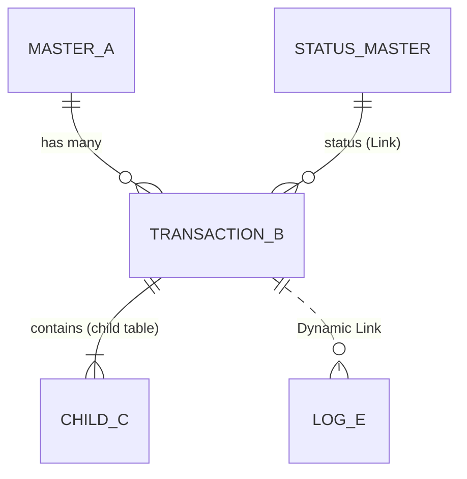

# DocType Architecture Planning

## When to use

Trigger when the user asks to **plan or design a DocType architecture / data model** before writing JSON — e.g. "what doctypes do I need for X?", "design the schema for a ticketing/LMS/booking system", "can I reuse an existing doctype?", or "map entities for a new feature". This skill **plans only** (interview → reuse plan → diagram → spec tables); hand off JSON generation to doctype-builder workflows separately.

## Operating rules (follow for the whole session)

0. **Open with the interview — never the deliverable.** First response = Stage-1 questions with defaults — no diagram or spec tables yet, even if the user gave a detailed prompt.
1. **Ask 2–4 sharp questions per turn** — never a wall of 20. Propose a sensible default with each question so the user can reply "yes to all".
2. **A stage is not one turn.** Stage 4 alone spans 2+ turns; pick the highest-leverage 2–4 decisions per turn.
3. **Restate the full running model every turn** — lead with "Running model now:" and all doctypes decided so far.
4. **Fill obvious gaps yourself** — don't ask about `owner`/`creation`; only escalate genuinely ambiguous lifecycle/cardinality/permission decisions.
5. **Never emit the deliverable until user-confirmed** — Stages 1–4 answered across at least 2–3 turns **and** the user explicitly confirmed the running model once. Stages 5–7 can default with assumptions listed.
6. **Push back on weak answers** — challenge non-scaling choices (e.g. comma-separated criteria string) and explain the tradeoff before landing a better default.
7. **Reconnaissance before any new doctype** — scan the app first; default priority: **reuse → extend → create new**.

## Procedure — staged interview

| Stage | Focus | Typical turns |
|-------|--------|---------------|
| 1 — Domain & actors | Roles, core noun, lifecycle driver, target app/module | 1 |
| 2 — Entities & cardinality | Masters vs transactions, 1:N vs N:M, stored vs computed | 1–2 |
| 3 — Lifecycle & status | `docstatus` vs status field vs Workflow doctype | 1 |
| 4 — Relationships | Link vs Dynamic Link, child vs separate, join doctype, tree, `fetch_from` | 2+ |
| 5 — Fields & data | Required/computed fields, naming strategy, uniqueness, `depends_on` | 1 (defaults-heavy) |
| 6 — Permissions | Roles, `if_owner`, User Permissions, perm levels, sharing | 1 (defaults-heavy) |
| 7 — Integrations | Log doctypes, notifications, scheduled jobs, Single settings | 1 (defaults-heavy) |

### Codebase reconnaissance (mandatory, read-only)

Run before proposing new doctypes; present verdict as **Reuse & extension plan** in the deliverable (before the diagram).

1. **Locate app doctypes:** `apps/<app>/**/doctype/*/*.json`; widen to installed standard apps for shared entities (`User`, `Contact`, `Print Format`, etc.). Confirm via `bench --site <site> list-apps`.
2. **Check existing extensions:** app `fixtures`, `**/custom/*.json`, `create_custom_fields(...)` in hooks/patches.
3. **Read candidate `.json` files** — fields, `istable`, `issingle`, `is_submittable`, `autoname`, `links`.
4. **Match by purpose, not name** — "candidate" → `User`/`Contact`; "template" → `Print Format`.
5. **Verdict per entity:** Reuse as-is / Extend / Create new — with reason.

**Extension mechanism:**

| You own the doctype? | How to extend |
|---------------------|---------------|
| Yes — in your app | Edit its `.json` + controller |
| No — in `frappe`/`erpnext`/another app | **Custom Field** + **Property Setter** via `create_custom_fields()` + **filtered fixtures** — never fork upstream JSON |
| Behavior only | `doc_events`, Server Script, Client Script, Property Setter for hide/relabel |

## Decision frameworks

### DocType kind

| Kind | Use when | Flags |
|------|----------|-------|
| Master | Reference data, linked from many places | normal |
| Transaction | Event with lifecycle | status field; sometimes `is_submittable` |
| Child table | Rows owned by one parent, no independent listing | `istable=1` |
| Single | One global config record | `issingle=1` |
| Tree | Hierarchy with rollups | `is_tree=1` |
| Log | Immutable audit / external-sync record | read-only response fields |

### Link vs Dynamic Link

- **Link** — field always targets one known doctype (default).
- **Dynamic Link** — `reference_doctype` + `reference_name` when one record must attach to many unrelated doctypes (comments, activities, payment party, API logs).

### Child table vs separate doctype

- **Child table** — lifecycle dies with parent, always loaded inline, never independently permissioned/listed.
- **Separate doctype** — reusable across parents, own permissions/list views, or polymorphic references.

### status field vs Workflow vs docstatus

- **docstatus (0/1/2)** — only for true submit semantics (GL, stock, legal immutability).
- **status Select** — small fixed set (Backlog/Todo/Done).
- **status Link to master** — admins extend statuses; master carries category/color/behavior.
- **Workflow doctype** — approval gates and role-gated transitions; heavier than code-only state machines.

### Reuse vs extend vs create

| Verdict | When | Mechanism |
|---------|------|-----------|
| Reuse as-is | Standard doctype already models concept (`User`, `Contact`, `Print Format`) | `Link` only |
| Extend | ~80% there; a few fields/status on existing doctype | Own app → edit `.json`; other app → **Custom Field** / **Property Setter** via `create_custom_fields` + filtered fixtures — never fork upstream JSON |
| Create new | Own identity, lifecycle, list view, or extending would bloat a cohesive record | New doctype JSON in your app |

### Exporting customizations (fixtures)

Filter fixtures to **your app's fields only** — a bare `fixtures = ["Custom Field"]` exports every site's customization:

```python
fixtures = [
    {
        "dt": "Custom Field",
        "filters": [["fieldname", "in", ["custom_passing_pct", "custom_rubric"]]],
    },
    {
        "dt": "Property Setter",
        "filters": [["module", "=", "My App"]],
    },
]
```

Export: `bench --site mysite export-fixtures` → JSON under `fixtures/` → synced on `bench migrate`.

## Pattern library (production apps)

1. **Activity via Dynamic Link** — notes/tasks/comments on any parent (`reference_doctype` + `reference_name`).
2. **Configurable status master** — status is `Link` to master with category/color, not hardcoded `Select`.
3. **Audit child table** — transition history visible on the record (from/to/duration/owner).
4. **SLA via per-priority child table** — agreement + priority targets + working hours children.
5. **Many-to-many join doctype** — standalone doctype with both Links + metadata (`is_admin`, weight, etc.).
6. **Settings Single** — `issingle=1` aggregating config child tables.
7. **External sync Log** — immutable log + Dynamic Link to source + async child for polling.
8. **Single-hop `fetch_from`** — `fetch_from: link_field.field_on_linked`; chain level-by-level for grandparent scope — never two-dot expressions.
9. **Role config + booking split** — master holds availability schedule; transaction is the booked session.
10. **Issued credential** — transaction with unique number, dates, evaluator, `Link` to `Print Format` template.
11. **Reusable question / quiz composition** — question master joined into quiz via child table with per-quiz marks; submissions as transaction + per-question result child (LMS pattern).
12. **Feature flags via Check fields** — orthogonal toggles (`enable_certification`, `is_archived`) instead of lifecycle status when features are add-ons.

### Naming strategies (pick per doctype; builder emits JSON)

- **Naming series** — `CRM-LEAD-.YYYY.-` with `naming_series` Select field.
- **`field:fieldname`** — natural-key naming (`field:evaluator`).
- **`hash` / Random** — child/join rows with no human-facing ID.
- **`autoincrement`** — high-volume internal records never shown to users.
- **`autoname` expression** (`naming_rule: Expression`) — `ASG-{#####}`; distinct from naming series.
- **Tree** — `is_tree=1` adds Nested Set columns; naming is convention-only (often `field:` but not required).

## Deliverable format (after user confirms model)

Deliver in this exact order (a–g):

**a. Restated understanding** — 2–4 sentences (feature, core entity, actors, lifecycle).

**b. Reuse & extension plan** — table: each entity → Reuse `X` / Extend `X` (+ mechanism) / Create new, with reason. Name standard doctypes reused (`User`, `Print Format`, …).

**c. Mermaid diagram** — every doctype and link; mark reuse/extend/new. Prefer `erDiagram`:



Notation: `||--o{` one-to-many, `}o--o{` many-to-many via join doctype, `||--|{` child-table containment, `..` = Dynamic Link. Status from a master is always **`Link`**, never `Select`.

**d. Per-doctype spec tables** — one block per doctype (and one per *extended* doctype listing only added fields):

| fieldname | fieldtype | options / target | reqd | why |
|-----------|-----------|------------------|------|-----|

**e. Relationship map in prose** — name the backing field for every link.

**f. Open assumptions** — defaults chosen on the user's behalf.

**g. Handoff offer** — offer `frappe-doctype-builder` for JSON; `state-machine-transitions.md` for lifecycle code; escalate to system architect for multi-app/migration concerns.

Do **not** write files in this skill. See upstream for a full worked example ("evaluation system for issuing certificates").

## Gotchas

- A master-driven status must be **`Link`**, not `Select`.
- `fetch_from` is **one hop** — grandparent values need an extra Link or chained fetches.
- Don't extend `User` with dozens of feature fields — create a linked profile doctype.
- Never edit another app's DocType JSON — use Custom Fields + Property Setters.
- Reserve `is_submittable` for financial/legal immutability; most apps use status fields.

## Source

- https://github.com/Venkateshvenki404224/frappe-apps-manager/blob/main/frappe-apps-manager/skills/frappe-doctype-architect/SKILL.md
